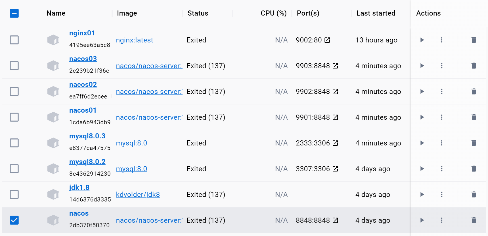

# spookify
**Assignment for Program Ellective**

1. 基本介绍

   常规JavaWeb项目

   使用的技术：SpringBoot + Vue + Docker(待定) + MyBatis(Plus) + SpringCloud(待定)

2. 注意事项

   * 大文件自己本地建一个文件夹，自己写.gitignore，不要上传到仓库！
   * 每次提交都必须详细写明提交信息，否则无法追溯
   * 推荐本地多建几个开发分支

3. 相关资源

   [SpringBoot学习资源](https://www.yuque.com/leifengyang/springboot3/vznmdeb4kgn90vrx)：有些深入，SpringBoot是Spring生态中的重要组成部分，优点是快速集成各种常见技术

   [JavaScript学习资源](https://www.runoob.com/jsref/dom-obj-attributes.html)：虽然烂大街，但有效

   [JavaScript查询资料](https://developer.mozilla.org/zh-CN/)：供查阅

   [Git文档](https://git-scm.com/book/zh/v2)：查阅命令，了解原理

   [MyBatis](https://www.cnblogs.com/diffx/p/10611082.html)：MyBatis是常见的持久层框架，用于数据存取，我们需要用它和MySQL数据库打交道

   [SpringCloud]()：也是Spring生态中的重要组成，用于微服务架构的快速搭建

   [Docker](https://learn.lianglianglee.com/%E4%B8%93%E6%A0%8F/%E7%94%B1%E6%B5%85%E5%85%A5%E6%B7%B1%E5%90%83%E9%80%8F%20Docker-%E5%AE%8C)：推荐下载[Docker Desktop for Window](https://www.docker.com/products/docker-desktop/)，用于持续集成和部署。以后的数据库、消息队列都下载到Docker中。Docker极其轻量化，真香（下面是我本机Docker上的4台nacos和2个MySQL数据库）

   

4. 其他

   下载配置完Docker后可以自己装MySQL，各种MQ，注册中心之类的组件，**然后你就可以删除本地庞大的MySQL之类的大容量程序了**。通过**IDEA连接Docker**，你可以快速启动任何容器。

   上述所有步骤本人均试过，能够正常跑起来。有任何疑问，欢迎咨询QJY。

   最后祝大家成功！！！

   

   
   
   

